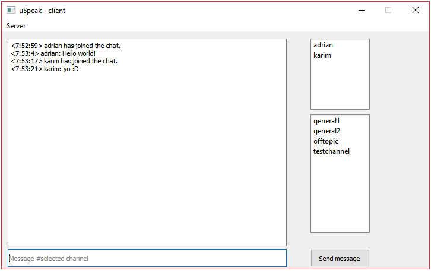
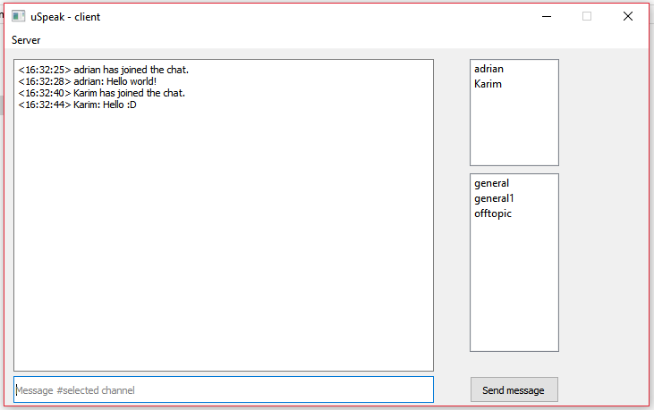

# uSpeak
 A text based teamspeak-like chat application with GUI
## dependencies
* Python3
* PyQt5

## installation and execution
1. Install the latest python3 version  https://www.python.org/
2. Clone repository
```
git clone https://github.com/adri711/uSpeak.git
```
3. install pyqt5 with pip
```pip install PyQt5```
4. Now change config.ini in server folder open a terminal in that folder and run the following command
```python server.py```

5. Open the launcher in the client folder and connect to the server

## Pictures



